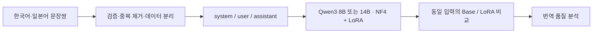

# Qwen3 Korean–Japanese Translation Fine-tuning

Qwen3 8B·14B의 한국어↔일본어 번역을 위한 4-bit NF4 + LoRA 실험 코드입니다.
기존 `Translate-Project`에서 전처리·학습·추론 부분을 선별해 연구 포트폴리오 형태로 정리했습니다.

**현재 상태:** 코드 이전과 CPU 기반 데이터 검증을 완료했습니다. 이 저장소에서 모델을 재학습하거나 번역 성능을 측정하지는 않았습니다. 기존 학습 로그·체크포인트·실제 비교 결과는 아직 포함되어 있지 않습니다.



## 구성

| 경로 | 역할 |
|---|---|
| `scripts/preprocess.py` | 원본 JSON / instruction JSONL → messages JSONL, 학습·검증 분리 |
| `scripts/train.py` | 두 모델에 공통으로 사용하는 QLoRA 학습 진입점 |
| `scripts/inference.py` | 같은 입력·프롬프트·생성 조건으로 Base와 LoRA 결과 저장 |
| `configs/` | 원본 코드에서 추출한 8B·14B 학습 설정 |
| `data/` | 직접 작성한 형식 예제, 데이터 준비 설명 |
| `evaluation/` | 비교 방법, 결과 기록 양식, 실행 예제 |
| `assets/` | 실제 결과 이미지 등 추후 추가할 자료 안내 |
| `archive/` | 이전한 원본 코드와 원래 의존성 목록 보존 |
| `docs/migration.md` | 파일별 출처, 수정 내역, 확인되지 않은 내용 |

## 코드에서 확인한 설정

| 항목 | Qwen3 8B | Qwen3 14B |
|---|---:|---:|
| LoRA r / alpha / dropout | 16 / 16 / 0.05 | 16 / 16 / 0.05 |
| 양자화 | 4-bit NF4, double quantization | 동일 |
| Learning rate / epochs | 2e-4 / 2 | 동일 |
| Train batch × accumulation | **6 × 3 = 18** | **1 × 16 = 16** |
| Eval batch | 4 | 2 |
| Max length / packing | 160 / true | 동일 |
| Train·validation 샘플 비율 | 각각 10% | 각각 10% |
| Seed | 42 | 42 |

LoRA 대상은 `q_proj`, `k_proj`, `v_proj`, `o_proj`, `gate_proj`, `up_proj`, `down_proj`입니다.
위 표는 **소스 코드에 설정된 값**입니다. 최종 학습 실행에 실제로 적용된 값은 과거 로그로 확인해야 합니다.
또한 여기서 Base는 `Qwen/Qwen3-8B` 또는 `Qwen/Qwen3-14B`에 이번 번역 LoRA를 적용하기 전 상태를 뜻합니다. 별도 모델인 `Qwen3-*-Base`를 뜻하지 않습니다.

## 데이터만 검증하기 — GPU 불필요

Python 3.10 이상을 사용합니다. 저장소 루트에서 다음을 실행합니다.

```powershell
py -3.12 -m venv .venv
.\.venv\Scripts\python.exe -m pip install PyYAML==6.0.2
.\.venv\Scripts\python.exe -m unittest discover -s tests -v
.\.venv\Scripts\python.exe scripts/preprocess.py --input data/sample_raw.jsonl --output-dir data/processed
.\.venv\Scripts\python.exe scripts/train.py --config configs/qwen3_8b_lora.yaml --sample-ratio 1 --check-only
.\.venv\Scripts\python.exe scripts/inference.py --model Qwen/Qwen3-8B --input evaluation/sample_inputs.jsonl --output outputs/demo_check.jsonl --check-only
```

예제는 직접 작성한 12개 문장쌍이며 기존 말뭉치에서 복사한 데이터가 아닙니다. 형식·실행 확인용이고 성능 평가 자료가 아닙니다.
`--check-only`는 모델을 내려받거나 학습하지 않습니다. 예제 데이터는 작으므로 검증할 때만 `--sample-ratio 1`로 원본의 10% 설정을 덮어씁니다.
전처리는 기존 결과 파일을 덮어쓰지 않으므로 재실행할 때는 새 출력 폴더를 지정하세요.

## 실제 학습 및 추론

NVIDIA CUDA GPU와 적합한 CUDA PyTorch 환경, 사용 권한이 있는 원본 데이터가 필요합니다.
GPU에 맞는 PyTorch 설치는 [공식 설치 안내](https://pytorch.org/get-started/locally/)를 사용하세요.
`requirements.txt`는 정리한 코드의 실행 대상 범위이며 **과거 실험의 환경을 복원한 lock 파일이 아닙니다.** 전체 GPU 실행은 아직 검증하지 않았습니다.

```powershell
.\.venv\Scripts\python.exe -m pip install -r requirements.txt
# 예제 대신 실제 데이터를 별도 폴더에서 전처리합니다.
# YAML의 train_file / validation_file을 실제 전처리 결과 경로로 바꿉니다.
.\.venv\Scripts\python.exe scripts/preprocess.py --input data/raw --output-dir data/processed_full
.\.venv\Scripts\python.exe scripts/train.py --config configs/qwen3_8b_lora.yaml --check-only
.\.venv\Scripts\python.exe scripts/train.py --config configs/qwen3_8b_lora.yaml
.\.venv\Scripts\python.exe scripts/train.py --config configs/qwen3_14b_lora.yaml
.\.venv\Scripts\python.exe scripts/inference.py --model Qwen/Qwen3-8B --adapter outputs/qwen3-8b-lora-10ratio/lora_adapters --input evaluation/sample_inputs.jsonl --output outputs/8b_comparison.jsonl
```

학습은 LoRA 어댑터·설정·패키지 버전·지표를 `outputs/`에 저장합니다. 원본 코드의 양자화 모델 자동 병합은 제외했습니다.
추론은 Base 결과를 먼저 생성한 뒤 같은 모델에 어댑터를 장착해 비교합니다. 프롬프트·seed·생성 설정을 결과와 함께 기록합니다.
모델 가중치, 원본 데이터, 실행 결과와 비밀 설정은 Git에서 제외합니다. 공개할 결과는 확인 후 별도로 `evaluation/`에 정리합니다.

## 결과와 한계

- 현재 정량 점수와 실제 Base/LoRA 비교 출력은 미등록입니다. 성능 향상을 주장하지 않습니다.
- 이전 대화의 약 140만 건, validation 10% 등은 확인된 데이터 파일·로그 없이 확정하지 않았습니다.
- 원본 전처리에는 원문 전달 불일치가 있었습니다. 새 실행용 코드에서 수정했지만, 과거 학습 데이터가 영향을 받았는지는 확인되지 않았습니다.
- 8B와 14B의 유효 배치 크기가 다릅니다. 비교 결과에는 모델 크기 외 학습 조건 차이도 함께 적어야 합니다.
- 짧은 `max_length=160`, packing, 전체 문장에 대한 loss, 데이터 10% 샘플링은 원본 설정을 유지한 실험상의 제한입니다.
- 새 전처리는 같은 방향의 동일 원문 중복을 제거합니다. 의미가 유사한 문장이나 역방향 문장쌍까지 분리하는 검증은 별도 과제입니다.

[이전 내역](docs/migration.md) · [데이터 안내](data/README.md) · [평가 안내](evaluation/README.md) · [2단계 설명](docs/stage2.md)

## 참고

- [Qwen3 8B 공식 모델 카드](https://huggingface.co/Qwen/Qwen3-8B): Qwen3 지원 버전 및 chat template 사용법
- [TRL 0.19.1 SFTTrainer](https://huggingface.co/docs/trl/v0.19.1/sft_trainer): 현재 스크립트가 대상으로 삼은 API
- [원본 Translate-Project](https://github.com/johangjoo/Translate-Project): 비공개 저장소, 필요한 원본은 `archive/`에 보존
